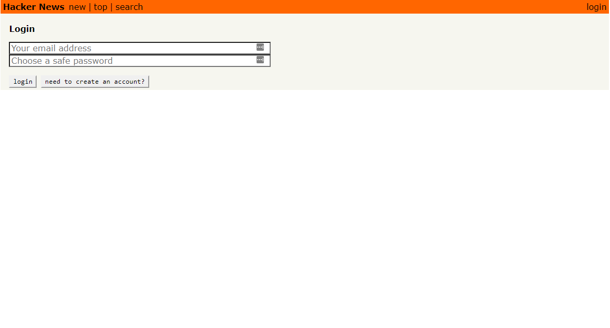
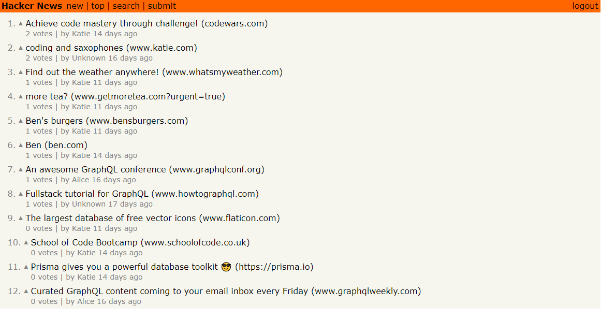

# Hacker News Clone

##### February 2021

_This is my first project using GraphQL and I followed a [tutorial](https://www.howtographql.com) to make this Hackernews clone. The server is built from scratch using Node.js, Apollo-Server and Prisma and the front-end is made with React and Apollo Client. Still some bugs to fix!_

## Main Learning Points:

### Backend

- I learnt the basics of how a GraphQL server works - I defined a GraphQL Schema for the server and wrote corresponding resolver functions
- I added a SQLite database to the project and managed it with Prisma
- I implemented login functionality which enabled users to authenticate against the API. This also allowed me to check the permissions of my users for certain API operations
- I learnt how to allow the consumers of the API to constrain the list of items they retrieve from the API by adding filtering and pagination capabilities to it

### Frontend

- I learnt how to display a list of links
- I then searched the list of links using the `useLazyQuery` hook from Apollo Client
- I handled user authentication using tokens
- I allowed authenticated users to create new links and upvote links with the `useMutation` hook
- I learnt about real-time updates with Subscriptions

## Technologies:

### Backend

- JavaScript
- Node.js
- Apollo Server (a fully-featured GraphQL Server)
- Prisma (replaces traditional ORMs. I used Prisma Client to access my database inside of GraphQL resolvers.)
- GraphQL Playground (A “GraphQL IDE” that allows you to interactively explore the functionality of a GraphQL API by sending queries and mutations to it. It's similar to Postman which offers comparable functionality for REST APIs.)

### Frontend

- JavaScript
- React
- Apollo Client (production ready, caching GraphQL client - it saves you from writing infrastructure code for networking and caching)

## Still To Do:

- There's currently a bug when clicking through the links on the `new` page. They don't always load properly. I need to look into caching as I'm currently getting an error which says:

> Cache data may be lost when replacing the links field of a Feed object. To address this problem (which is not a bug in Apollo Client), define a custom merge function for the Feed.links field, so InMemoryCache can safely merge these objects
